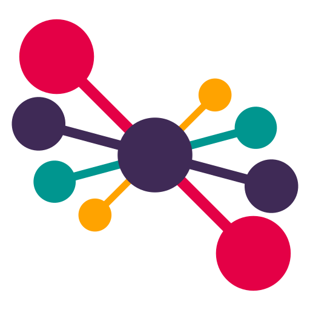

  
  <h1> TOMMY: Interactive Topic Modeling </h1>

Note: this project is open sourced, and should therefore not get deleted 
after the project is finished.

# Table of Contents

- Description
- Installation
- Usage
- Support
- Contributing
- Authors and Acknowledgment
- License

# Description

TOMMY is a tool for interactive topic modeling. It is designed to be used by
researchers and data scientists who want to explore their data and extract
topics from it without requiring extensive programming experience. TOMMY is
built on top of the
[LDA](https://en.wikipedia.org/wiki/Latent_Dirichlet_allocation),
[NMF](https://en.wikipedia.org/wiki/Non-negative_matrix_factorization) and
[BERTopic](https://maartengr.github.io/BERTopic/index.html) algorithms. It
provides a user-friendly interface for exploring the topics extracted from the
data.

# Installation

The executables can be downloaded off of [tommy.fyor.nl](tommy.fyor.nl).
Instructions for the installation process can be found in the
[installation guide](https://tommy.fyor.nl/wiki-user/Installation-guide.html#).
Note that this website is written in Dutch.

# Usage

The software can be used to explore topics in a dataset. The user can import
a dataset by selecting the 'Import' button in the top left corner. This will
open a window where you can select the folder containing the dataset. TOMMY
will then try to read all the files in the folder and display them in the
file overview. After this is done, you can select the different parameters
on the left, and run the topic modeling algorithm by clicking the
'Toepassen' button just below.

You can exclude words from the analysis by selecting the 'Blacklist' tab,
by filling in the words you want to exclude in the text box. These must be
separated by an enter.

# Support

If you have any questions or issues, feel free to make a post on this
repository. We will try to respond as soon as possible.

# Contributing

If you want to contribute to this project, feel free to make a pull request.
We ask you to follow the styleguide provided in the repository. Additionally,
it would be appreciated if you could provide a brief description of the
changes and the reason for them. This will help us to understand the changes
and to merge them more quickly. Please try to include tests for the changes,
reducing the likelihood of breaking the software for everyone.

# Authors and Acknowledgment

This software has been developed by students of Utrecht University as part of
our graduation project. This project has been commissioned by the Dutch
company EMMA.

The students who have contributed to this project are:

- [Jasper Hofman]()
- [Nick Jordan](https://www.linkedin.com/in/nick-jordan-11247bba/)
- [Erben Klaver](https://www.linkedin.com/in/erben-klaver-6b39a31a9/)
- [Fyor Lambermont](https://linkedin.com/in/fyor-lambermont)
- [Thomas Loef]()
- [Mees Notermans](https://www.linkedin.com/in/mees-notermans/)
- [Wessel van der Ven](https://linkedin.com/in/wesselvanderven)
- [Rens Versnel](https://linkedin.com/in/rens-versnel)
- [Isabelle de Wolf](https://www.linkedin.com/in/isabelle-de-wolf-5a2561254/)

Our supervisors are:

- [Gizem Sogancioglu](https://www.linkedin.com/in/gizem-sogancioglu-b8a94240/)
- [Dong Nguyen](https://www.linkedin.com/in/dongng/)

Our client is:

- [Lidwien van de Wijngaert](https://www.linkedin.com/in/lidwienvandewijngaert/)
  from [EMMA](https://www.emma.nl/)

# License

This project is licensed under the GNU AGPLv3 License - see the LICENSE.md file
for more details.