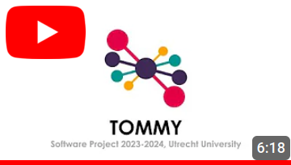

Welcome to TOMMY's wiki!
========================

**TOMMY** is an application that makes topic modelling easy and accessible, developed for EMMA by students from Utrecht University.

.. image:: _static/tommy.png
    :width: 100

Download
========

- :download:`TOMMY for Mac (Apple Silicon) <download/TOMMY-Installer-Apple-Silicon.dmg>`
- :download:`TOMMY for Mac (Intel) <download/TOMMY-Installer-Intel.dmg>`
- :download:`TOMMY for Windows <download/TOMMY-windows.zip>`
- :download:`TOMMY for Linux <download/TOMMY-linux.zip>`

.. toctree::
    :maxdepth: 1
    :caption: User wiki

    wiki-user/User-guide.md
    wiki-user/Installation-guide.md

Video demonstration of **TOMMY**:

.. toctree::
    :maxdepth: 1
    :caption: Developer wiki

    wiki-dev/Style-guide.md
    wiki-dev/Style-guide-source-control.md
    wiki-dev/Building.md
    wiki-dev/Generating-Mac-Installer.md
    wiki-dev/How-to-run-tests-from-PyCharm.md
    wiki-dev/Writing-unit-tests-with-PyTest.md
    wiki-dev/New-algorithm-settings.md

Code documentation
==================

.. autosummary::
    :toctree: code
    :caption: Code documentation
    :recursive:

    tommy
    tommy.view
    tommy.controller
    tommy.model