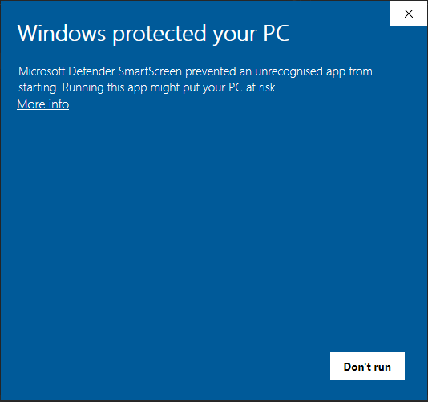
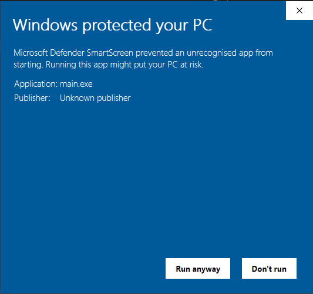

# Installatiehandleiding TOMMY

In deze handleiding wordt beschreven hoe TOMMY op verschillende besturingssystemen geïnstalleerd kan worden. 
De TOMMY software is te vinden op [https://tommy.fyor.nl/](https://tommy.fyor.nl/).

## macOS

Download afhankelijk van je Mac de juiste macOS-versie van de website. Als je niet weet welke versie je nodig hebt, 
navigeer dan naar het Apple logo linksboven in je scherm en klik op `Over deze Mac`. 
Als daar onder Chip "*Apple M...*" staat, download dan de Apple Silicon-versie, download anders de Intel-versie.

Open vervolgens het .dmg bestand en sleep de TOMMY applicatie binnen de installer naar de Applications map. 
Doordat de applicatie niet gesigneerd is, kan de applicatie niet direct in Launchpad geopend worden.

Navigeer daarom eerst in Finder naar de Apps folder. Dubbel-klik vervolgens op de TOMMY applicatie, waarbij de volgende waarschuwing weergegeven zal worden:

*'Tommy.App' kan niet worden geopend omdat Apple het bestand niet kan controleren op kwaadaardige software.*

Negeer deze waarschuwing door op `OK` te klikken. Klik vervolgens in de Finder met rechtermuisknop op de TOMMY applicatie en kies voor `Open`.
Er zal een soortgelijke waarschuwing weergegeven worden, hoewel dit keer ook op `Open` geklikt kan worden.
Door op `Open` te klikken, zal de applicatie na enige tijd - dit kan even duren - geopend worden (en is dan klaar voor gebruik). 

Dit is eenmalig; voortaan kan de applicatie direct vanuit Launchpad geopend worden.

## Windows

Download de windows-versie van de website.

Pak het zip-bestand uit op de plek waar je het programma wilt opslaan. Zorg dat het .exe bestand in dezelfde map staat waar ook de '_internal' map in staat.

Dubbel-klik het .exe bestand om de TOMMY applicatie te starten. Het is mogelijk dat Windows een melding geeft dat de applicatie niet herkend wordt. Die waarschuwing ziet er als volgt uit:

De waarschuwing komt omdat het developer team op dit moment niet beschikt over een certificaat om de code mee te signeren. De waarschuwing kan genegeerd worden door op 'More info' en vervolgens op 'Run anyway' te klikken.

Dit hoeft eenmalig; voortaan zal er geen waarschuwing worden gegeven als de applicatie wordt geopend.

### Toevoegen aan bureaublad
Ga naar het bureaublad en klik met rechtermuisknop op een lege plek op het bureaublad.

Selecteer nieuw > Snelkoppeling.

Voer de bestandslocatie van de applicatie in of selecteer Bladeren om het item te zoeken in Verkenner, selecteer de locatie en selecteer 'OK'.

Selecteer 'Volgende'. Geef de snelkoppeling optioneel een naam en selecteer 'Voltooien'.

## Linux

Download de linux-versie van de website.

Pak get zip-bestand uit op een plek waar je het programma wilt opslaan.

Draai 'main' door er in een file explorer op te klikken, of door het via een terminal te draaien.
