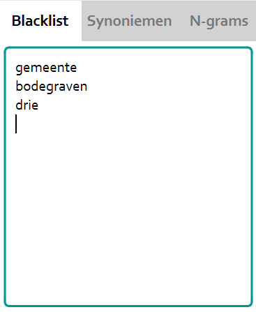
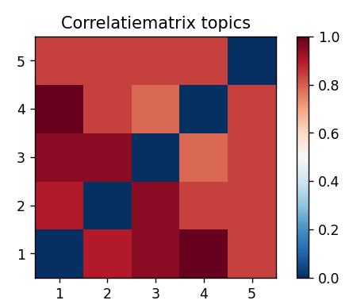
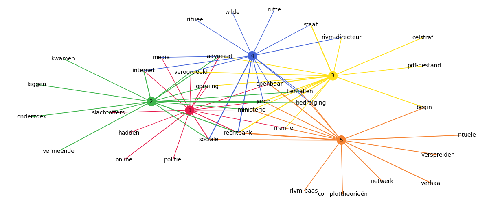
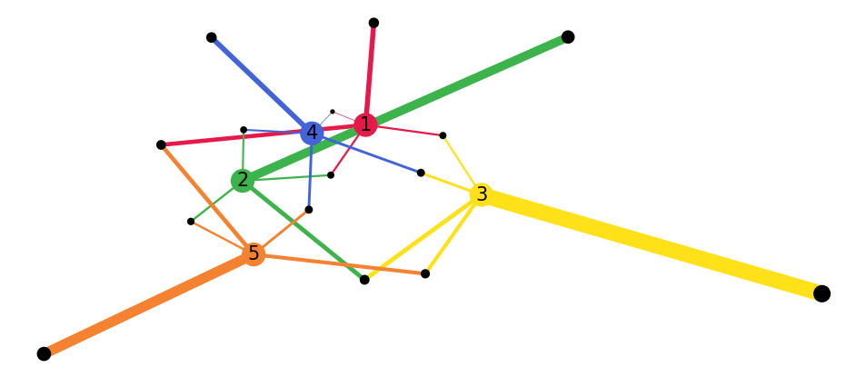

# Gebruikershandleiding TOMMY

## Introductie
TOMMY is een topic modelling applicatie die ontwikkeld is door studenten
van de Universiteit Utrecht in opdracht van EMMA. Voor het uitvoeren van
topic modelling wordt het achterliggende Latent Dirichlet Allocation (LDA)
algoritme uitgevoerd op de door de gebruiker aangeleverde bestanden. LDA
is een algoritme dat topics herkent in deze bestanden. Het aantal topics N
kan door de gebruiker gekozen worden. LDA zal dan N lijsten teruggeven met
woorden en bijbehorende gewichten, waarbij het gewicht een indicatie is voor
hoeveel een woord bij een topic past. Het algoritme gaat ervan uit dat elk
document elk topic bevat, ook al is het maar voor een heel klein deel. In deze
gebruikershandleiding staat beschreven hoe u TOMMY kunt gebruiken en hoe
deze ruwe data van het LDA algoritme goed onderzocht kan worden.

## Installatie

De software kan op drie verschillende besturingssystemen geïnstalleerd worden:
macOS, Windows en Linux. In de Installatiehandleiding staat nader beschreven
hoe TOMMY voor elk besturingssysteem op de juiste manier geïnstalleerd kan
worden.

## Bestanden importeren

Het programma ondersteunt momenteel drie verschillende file formats: PDF
bestanden, Docx bestanden (Word bestanden) en zogenaamde csv format be-
standen. Meer informatie over de csv format volgt onder het kopje ’csv format’.
Het is aan te raden een input folder aan te maken op de computer om hier
alle bestanden te verzamelen. Subfolders in de import folder worden niet onder-
steunt. Een input folder kan gekozen worden door onder het kopje bestanden
links bovenin het scherm te kiezen voor de optie Selecteer input folder.

Nadat de bestanden zijn geïmporteerd, zijn deze te vinden in de bestands-
weergave onder het kopje geïmporteerde bestanden. De bestanden worden aan-
geduid met een titel als deze is meegegeven en anders met de bestandslocatie. Er
wordt metadata over het bestand getoond als u op een bestand in geïmporteerde
bestanden klikt. Deze data bevindt zich onder bestandsinformatie en bevat on-
der andere het aantal woorden, bestandsformat en de bestandsgrootte.

## CSV format

Om veel data in het programma te laden is er een format bedacht welke dit voor
de computer leesbaar maakt. Dit format bestaat uit een csv bestand waarbij de
eerste regel een lijst aan headers is. Elke regel hierna beschrijft een document.
Om een csv bestand te kunnen inlezen moet er moet er minimaal een header
genaamd ”body” aanwezig zijn. Dit geeft aan dat deze kolom de tekst bevat die 
geanalyseerd moet worden. Daarnaast worden er een aantal optionele headers
ondersteund.

1. title: Deze header geeft aan dat de desbetrevende kolom de titels van
de documenten bevat. Deze titels worden dan gebruikt onder het kopje
geïmporteerde bestanden zoals later beschreven wordt.
2. date: Deze header geeft aan dat deze kolom de publicatiedatums van de
documenten bevat. Dit wordt op dit moment nog niet gebruikt in het
programma.
3. author : Deze header geeft aan dat deze kolom de schrijvers van de do-
cumenten bevat. Dit wordt op dit moment nog niet gebruikt in het pro-
gramma.
4. url : Deze header geeft aan dat de kolom de linkjes naar de bron van
het document bevat. Dit wordt op dit moment nog niet gebruikt in het
programma.

## Topic modelling uitvoeren

Topic modelling wordt door de applicatie uitgevoerd op alle geïmporteerde be-
standen. Hierbij worden door de gebruiker geselecteerde instellingen meege-
nomen. Hieronder staat beschreven hoe deze instellingen aangepast kunnen
worden.

### Algemeen

De meest invloedrijke parameter op de uitkomst van het topic modelling algo-
ritme is de hoeveelheid topics. Dit getal is linksboven in de applicatie aanpas-
baar door onder het kopje Algemeen bij de instelling Aantal topics een geheel
getal in te voeren en vervolgens op enter te drukken. De hoeveelheid topics heeft
standaard de waarde 3. Het zal niet vaak nodig zijn om meer dan 20 topics te
gebruiken. In het algemeen geldt dat, hoe meer topics je kiest, hoe langer het
programma bezig zal zijn. Het is dan ook sterk af te raden om meer dan 100
topics in te voeren. Bovendien zijn de resultaten beter te interpreteren met een
lager aantal topics.

Een andere parameter onder het kopje Algemeen is de instelling Aantal woor-
den. Deze instelling bepaalt hoeveel woorden er zichtbaar zijn per topic. De
zichtbare woorden per topic zijn de woorden die het beste bij een topic passen.
De hoeveelheid woorden heeft standaard de waarde 10, maar is aanpasbaar door
een geheel getal in te voeren en vervolgens op enter te drukken.

### Hypermarameters

Naast de algemene instellingen, kunnen ook een aantal geavanceerde parameters
worden aangepast onder het kopje Hyperparameters

De alpha parameter bepaalt hoe verspreid de distibutie voor topic per do-
cument is. Een hogere alpha waarde moedigt het programma aan om zo veel
mogelijk topics te zoeken in een document. Bij een lagere alpha waarde zal
het algoritme slechts een paar dominate topics zoeken voor ieder document.
De alpha waarde kan aangepast worden door de automatische instellingen uit
te vinken bij de instelling Automatisch (aanbevolen). Vervolgens kan een
getal tussen de 0 en 1 ingevoerd worden bij de instelling alpha

De beta parameter bepaalt hoe verspreid de distibutie voor topic per woord
is. Een hogere beta waarde moedigt het programma aan om zo veel mogelijk
woorden te zoeken bij elke topic. Bij een lagere beta waarde zal het algoritme
slechts een paar dominate woorden zoeken voor ieder topic. De beta waarde
kan aangepast worden door de automatische instellingen uit te vinken bij de
instelling Automatisch (aanbevolen). Vervolgens kan een getal tussen de 0
en 1 ingevoerd worden bij de instelling beta.

Als het vakje naast de optie Automatisch blauw is gekleurd, worden de
standaard parameters gebruikt. Voor de alpha instelling is dit 1.0, en voor de
beta instelling is dit 0.01.

### Woorden uitsluiten

Niet alle woorden uit de geïmporteerde bestanden worden gebruikt bij topic
modelling. Bepaalde stopwoorden zoals lidwoorden en andere veel voorkomende
woorden als te, door en is worden standaard uit de bestanden gefilterd. Dit zorgt
ervoor dat enkel de belangrijke woorden overblijven, waardoor topics uit meer
betekenisvolle woorden zullen bestaan. Het kan echter nog steeds voorkomen dat
er woorden in de analyse opduiken die niet van toepassing zijn. In de praktijk
zal dit best vaak voorkomen, aangezien de standaardlijst van stopwoorden vrij
conservatief opgesteld is. Deze woorden kunnen uitgesloten worden door ze in
te voeren in het tekstinvoervak onder het tabblad Blacklist. Dit tekstveld is
aanpasbaar. Na elk woord kan op enter geklikt worden om naar een nieuwe
regel te springen om een nieuw woord in te vullen. Woorden kunnen ook vrij
verwijderd worden uit de lijst. Een voorbeeld van het uitsluiten van woorden is
zichtbaar in figuur 1. Tijdens het uitvoeren van LDA worden alle hoofdletters
omgezet naar kleine letters. Daarom is de blacklist niet case-sensitive, wat
betekent dat ”bodegraven“ en ”Bodegraven“ beiden hetzelfde woord uit zullen
sluiten.

Figuur 1: Het uitsluit veld met drie uitgesloten woorden.

### Synoniemen en N-grams

Het verwerken van synoniemen en n-grams wordt nog niet ondersteunt door de
software. De tabbladen Synoniemen en N-grams zijn nog niet functioneel.

### Topic modelling toepassen

Nadat de instellingen zijn aangepast, kan het algoritme uitgevoerd worden. Dit
wordt gedaan door op de Toepassen knop te klikken. Door deze knop wordt
het achterliggende algoritme uitgevoerd en worden er resultaten gegenereerd.
Dit kan enige tijd duren, denk aan enkele minuten of minder. De tijd is sterk
afhankelijk van de grootte van de geïmporteerde bestanden.

## Grafische resultaten

Na het klikken op Toepassen worden grafische resultaten gegenereerd die het
onderzoek naar de algoritmische uitkomst mogelijk maken. De grafieken worden
hieronder toegelicht.

### Woord aantal per document

Als het algoritme klaar is, wordt eerst de woordaantal grafiek getoond. In
deze grafiek is het aantal woorden per document zichtbaar. Deze grafiek kan
teruggevonden worden onder het tabblad Woordaantal bovenin het scherm.

### Woorden per topic

Elk topic bestaat uit woorden met een bijbehorend gewicht. Hoe hoger het
gewicht, hoe meer een woord bij dat topic hoort. Deze woorden zijn op meerdere
plekken in de applicatie te bekijken.

#### Lijst aan topic woorden

De meest voorkomende woorden per topic worden rechts in de applicatie ge-
toond. Veel woorden in deze lijst van topics overlappen echter met andere
topics. Om te zien of een woord in meerdere topics voorkomt, kan op een woord
in deze lijst geklikt worden. Dit woord wordt dan in elke topic waarin het
voorkomt gearceerd.

#### Grafieken topic woorden

Deze woorden met het hoogste gewicht worden tevens op twee verschillende
manieren gevisualiseerd; in een woordenwolk en in een staafdiagram. Deze gra-
fieken zijn zichtbaar door op een topic te klikken, en vervolgens te kijken onder
de tabbladen Woordenwolk en Woordgewichten die zichtbaar zijn boven in het
scherm nadat LDA is uitgevoerd. De woordenwolk geeft aan welke woorden het
meest passen bij een topic door deze woorden groter te maken. Het staafdia-
gram geeft hetzelfde weer, maar dan worden de gewichten en verhoudingen ook
gevisualiseerd. Dit zorgt ervoor dat woorden gemakkelijk met elkaar vergeleken
kunnen worden.

### Correlatiematrix

Een correlatiematrix geeft de mate van overeenkomst van verschillende topics
weer. Een donkerblauw vakje geeft aan dat de topics op de coördinaten van dit
vakje volledig overeenkomen. Donkerrood geeft aan dat de topics vrijwel geen
overeenkomsten hebben. De correlatiematrix is zichtbaar onder het tabblad
Correlatie boven in het scherm nadat LDA is uitgevoerd.

Het is belangrijk om hierbij te beseffen dat de matrix symmetrisch is over de
nevendiagonaal, van linksonder naar rechtsboven. De correlatie tussen topic 1
en 4 is namelijk identiek aan de correlatie tussen topic 4 en 1. Ook valt op dat
de nevendiagonaal enkel bestaat uit donkerblauwe vakjes. Een topic verschilt
namelijk niet van zichzelf.

Figuur 2: Correlatie tussen 5 topics

### Netwerken

Een essentieel onderdeel van de grafische resultaten zijn twee netwerken die re-
laties tussen topics en woorden/documenten weergeven. Deze netwerken geven
gelijktijdig meerdere verschillende aspecten van topics weer en zijn daarom van
groot belang bij het identificeren en begrijpen van de topics. Nadat LDA is
uitgevoerd is het netwerk tussen topics en woorden te vinden onder het tab-
blad Woord Netwerk. Nadat LDA is uitgevoerd is het netwerk tussen topics en
documenten te vinden onder het tabblad Doc. Netwerk.

#### Netwerk woorden en topics

Topics worden gedefinieerd door woorden met een bijbehorend gewicht. De
woorden met het hoogste gewicht zijn belangrijk voor een topic. Echter komen
veel woorden voor in meerdere topics. Deze woorden kunnen dan bijdragen aan
twee of zelfs meerdere topics. Indien een woord te veel bijdraagt aan alle topics
zou het kunnen dat dit woord niet veel toevoegt (en dus uitgesloten zou kunnen
worden). Om dit soort woorden op te sporen, is een netwerk een goed middel.
In het netwerk komen tevens ook woorden naar voren die maar aan ´e´en topic
gerelateerd zijn.

In Figuur 3 worden per topic de 15 belangrijkste woorden weergegeven. Als
een woord in meerdere topics voorkomt, zal dit naar voren komen door meerdere
lijnen vanuit dit woord. Tevens wordt het gewicht gevisualiseerd. Hoe belang-
rijker een woord is voor een topic, des te dikker is de lijn die dit topic met het
woord verbindt.

Figuur 3: Netwerk met relaties tussen woorden en topics

#### Netwerk documenten en topics

Volgens het LDA algoritme bevat elk document alle topics, ook al is dit vaak
maar voor een heel klein deel. Het is nuttig om te visualiseren hoe de documenten zich verhouden tot de topics om te zien welke documente voor het grootste
deel uit één enkel topic bestaan.

In Figuur 4 staat een netwerk die de relaties tussen groepen documenten
(de zwarte stippen) en topics weergeeft. Elke zwarte stip stelt alle documenten
voor die gerelateerd zijn aan de aangrenzende topics. De dikte van de lijnen is
een maat die het aantal documenten weergeeft die verbonden zijn aan een topic.
Des te dikker de lijn, des te meer documenten aan het topic toebehoren. Uit dit
netwerk is goed op te maken of een topic veel losse documenten heeft of juist
veel voorkomt in documenten in combinatie met een ander topic.

Figuur 4: Netwerk met relaties tussen documenten en topics

## Exporteren

De grafieken en netwerken kunnen geëxporteerd worden. Dit is mogelijk door
onder het kopje Bestand links bovin het scherm op de gewenste exporteer knop
te klikken.

De grafieken en netwerken kunnen als afbeelding opgeslagen worden op de
computer door op de optie Exporteer grafieken (.png) te klikken. Bij het kiezen
van deze optie zullen alle grafieken en netwerken opgeslagen worden. Vervolgens
kan er een folder worden gekozen om de afbeeldingen in op te slaan.

De netwerken kunnen ook geëxporteerd worden naar de software Gephi, om
die hier nog verder te bewerken. Dit is mogelijk door op de knop Exporteer naar
Graph Exchange XML Format (.gexf ) te klikken. Vervolgens kan er een folder
worden gekozen om de bestanden in op te slaan. Deze kunnen dan geopend
worden in de software Gephi.

### Bekende bugs

De software bevat momenteel nog een aantal bugs die in de toekomst verholpen
zullen worden:

- Als bij de hyperparameters een waarde ingevoerd wordt, kan het pro-
gramma terugspringen naar een waarde 1 voor zowel de alpha als beta instelling.
Deze kunnen dan niet aangepast worden.
- De synoniemen en n-grams zijn nog niet ondersteund in de software, maar
wel zichtbaar in de user interface.
- Als netwerken worden geëxporteert naar Gephi, worden de kleuren niet
overgenomen.