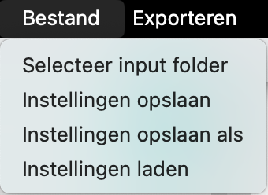

# Gebruikershandleiding TOMMY

## Introductie

TOMMY is een topic modelling applicatie die ontwikkeld is door studenten
van de Universiteit Utrecht in opdracht van EMMA. Voor het uitvoeren van topic
modelling wordt het achterliggende Latent Dirichlet Allocation (LDA) algoritme
of Non-Negative Matrix Factorization (NMF) algoritme uitgevoerd op de door de
gebruiker aangeleverde bestanden. LDA en NMF zijn topic modelling algoritmes
die topics herkennen in deze bestanden. Het aantal topics *K* kan door de
gebruiker binnen de applicatie gekozen worden. LDA of NMF zullen dan *K*
lijsten (dit zijn de topics) teruggeven met woorden en bijbehorende gewichten,
waarbij het gewicht aangeeft hoe sterk een woord bij een topic past. Het
algoritme gaat ervan uit dat elk document elk topic tot op zekere hoogte bevat,
ook al is het maar voor een heel klein deel. In deze gebruikershandleiding
staat beschreven hoe u TOMMY kunt gebruiken en hoe de ruwe data geproduceerd
door LDA of NMF goed onderzocht kan worden.

## Installatie

De software kan op drie verschillende besturingssystemen geïnstalleerd worden:
macOS, Windows en Linux. In de Installatiehandleiding staat nader beschreven
hoe TOMMY voor elk besturingssysteem op de juiste manier geïnstalleerd kan
worden.

## Bestanden importeren

Het programma ondersteunt momenteel vier verschillende bestandsformaten:
TXT-bestanden, PDF-bestanden, Docx bestanden (Word bestanden) en zogenaamde CSV
bestanden. Meer informatie over het CSV formaat volgt onder het kopje 'csv'.
Het
is aan te raden om op de computer een input folder aan te maken waar alle input
bestanden aan toegevoegd kunnen worden. Een input folder kan gekozen worden
door onder het
kopje 'Bestand' links bovenin het scherm te kiezen voor de optie 'Selecteer
input folder'. Binnen de geselecteerde input folder worden alle bestanden met
geldige bestandsformaten ingelezen, ook als ze in subfolders zijn
ondergebracht.

Nadat de gewenste bestanden zijn geïmporteerd, kunnen deze gevonden worden in
de bestandsweergave onder het
kopje 'Geïmporteerde bestanden'. De bestanden worden aangeduid met een titel
als deze beschikbaar is en anders met de bestandslocatie. Er wordt metadata
over het bestand getoond als u op een bestand klikt. Deze data kan gevonden
worden in het informatie-paneel onder het kopje 'Informatie' en bevat onder
andere het aantal woorden, bestandsformaat en de bestandsgrootte.

|                                     |
|:-------------------------------------------------------------------------:|
| *Voorbeeld van de inputweergave in het navigatie menu van TOMMY op macOS* |

### CSV formaat

Om veel bestanden in een keer in te laden is er een formaat bedacht die dit
voor de computer leesbaar maakt. Dit formaat bestaat uit een CSV-bestand
waarbij de eerste regel een lijst aan headers is. Elke regel hierna beschrijft
een document. Om een CSV-bestand te kunnen inlezen moet er moet er minimaal een
header genaamd 'body' aanwezig zijn. Dit geeft aan dat deze kolom de tekst
bevat die geanalyseerd moet worden. Daarnaast worden er een aantal optionele
headers ondersteund.

1. **title**: Deze header geeft aan dat de desbetreffende kolom de titels van
   de documenten bevat. Deze titels worden dan gebruikt onder het kopje
   'geïmporteerde bestanden' zoals eerder beschreven wordt.
2. **date**: Deze header geeft aan dat deze kolom de publicatiedatums van de
   documenten bevat. Deze kunnen gebruikt worden om visualisaties te maken over
   het tijdsverloop van de topics.
3. **author**: Deze header geeft aan dat deze kolom de schrijvers van de
   documenten bevat. Dit wordt op dit moment nog niet gebruikt in het
   programma.
4. **url**: Deze header geeft aan dat de kolom de linkjes naar de bron van
   het document bevat. Dit wordt op dit moment nog niet gebruikt in het
   programma.

### PDF, TXT en Docx formaten

PDF, TXT en Docx bestanden worden ingelezen door de volledige tekst uit de
bestanden te halen. Dit betekent dat titels, publicatie data en andere vormen
van metadata allemaal meegenomen worden in de topic modelling analyse. Het is
daarom aan te raden om de bestanden zo schoon mogelijk te houden en ook
eventuele afbeeldingen weg te laten. TOMMY accepteert enkel PDF en Docx
bestanden die niet corrupt zijn.

## Topic modelling

### Welke algoritme kan TOMMY gebruiken?

#### LDA

Het eerste topic modelling-algoritme dat TOMMY ondersteunt is Latent Dirichlet
Allocation (LDA). LDA is een algoritme dat topics herkent in documenten. De
topics worden herkend door eerst de documenten en woorden onder te verdelen in
random topics. Vervolgens wordt elk woord apart bekeken, om te kijken hoe
definiërend het woord is voor zowel een document als voor een topic. De topics
worden iteratief aangepast aan de hand van de meest definiërende woorden, tot
een bepaalde mate van convergentie is bereikt. Het algoritme gaat ervan uit dat
elk document elk topic bevat, ook al is dit maar voor een heel klein deel. De
topics worden gedefinieerd door woorden met een bijbehorend gewicht. Hoe hoger
het gewicht, hoe sterker een woord bij dat topic past.

#### NMF

Naast LDA is er ook een ander topic modelling algoritme beschikbaar, namelijk
Non-negative
Matrix Factorization (NMF). NMF beschouwt alle aangeleverde tekst als een grote
matrix van woorden die wel of niet voorkomen in een document. Het doel van het
algoritme is het opsplitsen van deze grote matrix in
twee kleine matrices: een document-topic
matrix en een topic-woord matrix. De document-topic matrix geeft aan
hoe sterk elk document bij een topic past, en de topic-woord matrix geeft aan
hoe sterk elk woord bij een topic past. Het algoritme gaat ervan uit dat elk
document elk topic bevat, ook al is dit maar voor een heel klein deel. De
topics
worden gedefinieerd door woorden met een bijbehorend gewicht. Hoe hoger het
gewicht, hoe sterker een woord bij dat topic past.

### Welk algoritme is beter?

Beide algoritmes hebben hun eigen voor- en nadelen. LDA is een algoritme
dat probabilistisch is, wat betekent dat het algoritme een kansverdeling zoekt
die de data het beste verklaart. NMF is een algoritme dat werkt met matrices,
waarbij de data wordt opgesplitst in twee matrices. LDA is vaak beter in het
vinden van abstracte topics, terwijl NMF vaak beter is in het vinden van meer
concrete topics. In de praktijk is het vaak handig om beide algoritmes uit te
proberen en te kijken welk algoritme de beste resultaten geeft.

## Topic modelling uitvoeren

Topic modelling wordt door de applicatie uitgevoerd op alle geïmporteerde
bestanden. Hierbij worden door de gebruiker geselecteerde instellingen
meegenomen. Hieronder staat beschreven hoe deze instellingen aangepast kunnen
worden.

### Visualisatie

#### # Topicwoorden

|  |
|:-------------------------------------------:|
|  *Voorbeeld van de visualisatie in TOMMY*   |

Deze instelling bepaalt hoeveel woorden er zichtbaar zijn per topic. De
zichtbare woorden per topic zijn de woorden die het beste bij een topic passen.
De hoeveelheid woorden heeft standaard de waarde 10, maar is aanpasbaar door
een geheel getal in te voeren.

### Algemeen

#### Algortime

|  |
|:----------------------------------------:|
|    *Het algoritme instellen in TOMMY*    |

Het algoritme dat gebruikt wordt voor topic modelling kan aangepast worden
onder het kopje Algemeen. Het algoritme kan worden ingesteld in het dropdown
menu onder de instelling 'Algoritme'. Hier kan gekozen worden tussen LDA en
NMF. Het algoritme staat standaard ingesteld op LDA.

#### # Topics

|   |
|:--------------------------------------:|
| *Het aantal topics instellen in TOMMY* |

De meest invloedrijke parameter op de uitkomst van het topic modelling
algoritme is de hoeveelheid topics. Dit getal is linksboven in de applicatie
aanpasbaar door onder het kopje Algemeen' bij de instelling 'Aantal topics'
een geheel
getal in te voeren. De hoeveelheid topics heeft
standaard de waarde 3. Het zal niet vaak nodig zijn om meer dan 20 topics te
gebruiken. In het algemeen geldt dat hoe meer topics er gekozen worden, hoe
langer het
programma bezig zal zijn. Het is dan ook sterk af te raden om meer dan 100
topics in te voeren. Bovendien zijn de resultaten beter te interpreteren met
een
lager aantal topics.

Het kan moeilijk zijn om te bepalen welk aantal topics het beste is voor de
gegeven data. In de K-plot is zichtbaar hoe de log-likelihood verandert met het
aantal topics. Hieruit is af te leiden hoeveel topics het beste gebruikt kunnen
worden. Hoe hoger de log-likelihood, hoe beter de topics passen bij de data.

#### Taal Corpus

|  |
|:-----------------------------------:|
|    *De taal instellen in TOMMY*     |

De taal waarmee de documenten geïnterpreteerd worden, kan worden aangepast
onder het kopje 'Algemeen'. De taal kan gewijzigd worden door een taal te
selecteren in het dropdown menu onder de instelling 'Taal corpus'. TOMMY
ondersteunt momenteel de talen Nederlands en Engels.

### LDA Hyperparameters

|  |
|:----------------------------------------------:|
|  *Aanpassen van LDA Hyperparameters in TOMMY*  |

Naast de algemene instellingen kan ook een aantal geavanceerde parameters voor
LDA worden aangepast onder het kopje 'Hyperparameters'.

De *alpha*-parameter bepaalt hoe verspreid de distributie voor topics per
document is. Een hogere  *alpha*-waarde moedigt het programma aan om zoveel
mogelijk topics te zoeken in een document. Bij een lagere  *alpha*-waarde zal
het algoritme slechts een paar dominante topics zoeken voor elk document. De
*alpha*-waarde kan aangepast worden door de automatische instellingen uit te
schakelen bij de instelling 'Automatisch (aanbevolen)' en vervolgens een waarde
tussen 0 en 1 in te voeren bij de instelling  *alpha*.

De  *beta*-parameter bepaalt hoe verspreid de distributie voor topics per woord
is. Een hogere  *beta*-waarde moedigt het programma aan om zoveel mogelijk
woorden te zoeken bij elk topic. Bij een lagere  *beta*-waarde zal het
algoritme slechts een paar dominante woorden zoeken voor elk topic. De  *beta*
-waarde kan aangepast worden door de automatische instellingen uit te schakelen
bij de instelling 'Automatisch (aanbevolen)' en vervolgens een waarde tussen 0
en 1 in te voeren bij de instelling  *beta*.

Als het vakje naast de optie 'Automatisch (aanbevolen)' blauw gekleurd is,
worden de standaard parameters gebruikt. Voor de  *alpha*-instelling is dit
0.33 en voor de  *beta*-instelling is dit 0.33.

### Woorden uitsluiten

|  |
|:----------------------------------------:|
|  *Het uitsluiten van woorden in TOMMY*   |

Niet alle woorden uit de geïmporteerde bestanden worden gebruikt bij topic
modelling. Bepaalde stopwoorden zoals lidwoorden en andere veelvoorkomende
woorden zoals '*te*', '*door*' en '*is*' worden standaard uit de
bestanden gefilterd. Dit zorgt ervoor dat alleen de belangrijke woorden
overblijven, waardoor de topics uit meer betekenisvolle woorden bestaan. Het
kan echter nog steeds voorkomen dat er woorden in de analyse opduiken die niet
van toepassing zijn. Deze woorden kunnen uitgesloten worden door ze in te
voeren in het tekstvak onder het tabblad 'Blacklist'. Na elk woord kan op enter
geklikt worden om naar een nieuwe regel te springen en een nieuw woord in te
vullen. Woorden kunnen ook vrij verwijderd worden uit de lijst.

### Synoniemen

|                                                                          | 
|:-----------------------------------------------------------------------------------------------------------------:|
| *Het toevoegen van synoniemen in TOMMY. Het woord 'gem.' wordt in de analyse vervangen met het woord 'gemeente'.* |

Het is ook mogelijk om synoniemen toe te voegen aan de analyse. Dit kan door
synoniemen in te voeren in het tekstvak onder het
tabblad 'Synoniemen'. Een synoniem kan worden ingevoerd door op één regel eerst
het woord dat vervangen moet worden te schrijven, gevolgd door een '='
teken, met afsluitend het woord waarmee de eerste term vervangen moet worden.
Na elk synoniem kan op enter geklikt worden om naar een nieuwe regel te
springen en een nieuw synoniem in te vullen. Synoniemen kunnen ook vrij
verwijderd worden uit de lijst.

### Topic modelling toepassen

Nadat de instellingen zijn aangepast, kan het algoritme uitgevoerd worden. Dit
wordt gedaan door op de 'Toepassen' knop te klikken. Door deze knop wordt het
achterliggende algoritme uitgevoerd en worden er resultaten gegenereerd. Dit
kan enige tijd duren, denk aan enkele minuten of minder. De tijd is sterk
afhankelijk van de grootte van de geïmporteerde bestanden.

## Grafische resultaten

### Distributie aantal woorden per document

De ingevoerde documenten die geanalyseerd worden, kunnen verschillende
aantallen woorden hebben. Het is nuttig om te weten hoe deze aantallen zijn
verdeeld. Bijvoorbeeld, als er uitschieters tussen zitten die invloed kunnen
hebben op de uitkomst van topic modelling, zal dit zichtbaar zijn in deze
grafiek. Op de x-as staan het aantal woorden per document, en op de y-as het
aantal documenten wat overeenkomt met dat aantal woorden.

|  |
|:------------------------------------------------------:|
|       *Distributie aantal woorden per document*        |

### K-waarde

Het is vaak lastig om de verschillende hoeveelheden topics te vergelijken om te
zien welk aantal het beste presteert. De k-waarde grafiek berekent een getal
voor
elk aantal topics, zodat ze goed met elkaar vergeleken kunnen worden. Dit getal
wordt de Umass genoemd. Om deze Umass te berekenen, moet
het topic modelling algoritme worden uitgevoerd voor elk aantal topics op de
x-as. Het genereren van deze plots kan daarom enige tijd duren.

|  |
|:--------------------------------------:|
|           *K-waarde grafiek*           |

De Umass is een waarde die de samenhang van een set topics meet. In
het
algemeen geldt; hoe dichter deze waarde bij nul ligt, hoe meer gescheiden de
topics zijn. In deze grafiek zouden 4 of 7 topics goede hoeveelheden topics
zijn
om mee te beginnen met onderzoeken.

Het is wel belangrijk om te beseffen dat deze grafiek niet aangeeft hoe goed de
topics te interpreteren zijn. Topic modelling met veel gescheiden topics kan
een Umass dicht bij de nul genereren, maar als deze topics niet
goed te interpreteren zijn voor mensen, is het handig om een andere hoeveelheid
topics te kiezen.

### Documenten over tijd

De documenten die worden gebruikt voor topic modelling bevatten vaak een datum.
Deze datum kan worden gebruikt om interessante patronen weer te geven die
nuttig kunnen zijn voor het interpreteren van de topics. De grafiek laat zien
wanneer topics het meest voorkomen. Er is een lijn voor elk topic, wat het
makkelijk maakt om verschillende topics met elkaar te vergelijken. Voor elk
document wordt berekend hoe sterk dit document bij elk topic hoort. Dit is een
getal van 0 tot 1. Voor elk topic in een termijn worden deze getallen opgeteld
om een waarde te verkrijgen. Deze waarde wordt vervolgens geplot. Het voordeel
van deze methode is dat topics die veel voorkomen in slechts een paar
documenten zwaarder wegen dan een ander topic dat minder voorkomt in dezelfde
documenten.

|  |
|:--------------------------------------------------:|
|               *Documenten over tijd*               |

De documenten-over-tijd grafiek bestaat ook voor individuele topics. Dit maakt
het makkelijker om kleine veranderingen duidelijker waar te nemen. Topic 4 in
de tweede grafiek toont duidelijk meer nuances dan hetzelfde topic in de eerste
grafiek.

|  |
|:----------------------------------------------------------:|
|            *Documenten over tijd voor topic 4*             |

### Verdeling topics over documenten

Niet alle topics komen even vaak voor in het corpus. Dit is al duidelijk in de
documenten-over-tijd grafiek, maar daar is het moeilijk om verschillende topics
met elkaar te vergelijken. Daarom bestaat de verdeling van topics over
documenten. Dit maakt het makkelijker om te vergelijken hoe vaak topics in het
corpus voorkomen.

|  |
|:-----------------------------------------------------------------:|
|                *Verdeling topics over documenten*                 |

### Correlatiematrix topics

Een correlatiematrix is een matrix die de correlatie tussen verschillende
variabelen weergeeft. In dit geval zijn deze variabelen de topics. De matrix
bevat kleuren van blauw tot wit. De blauwe kleur geeft een perfecte correlatie
aan en de witte kleur geeft geen enkele correlatie aan. Het is belangrijk om op
te merken dat de correlatiematrix symmetrisch over het antidiagonaal is. Dit
betekent dat de correlatie van topics 4 en 1 hetzelfde is als die van topics 1
en 4. Een topic is perfect gecorreleerd met zichzelf. Daarom zijn de vierkanten
langs de antidiagonaal blauw.

|  |
|:-------------------------------------------------:|
|             *Correlatiematrix topics*             |

### Gewichten van woorden en woordenwolk

De meest intuïtieve grafiek voor topic modelling is een grafiek die de woorden
voor elk topic en hun respectieve gewichten toont. Dit wordt gevisualiseerd in
de woordgewichten grafiek. Deze grafiek wordt voor elk van de topics
gegenereerd, in dit geval voor topic 4.

|  |
|:----------------------------------------------------:|
|         *Gewichten van woorden voor topic 4*         |

Dezelfde gegevens kunnen op een mooiere, maar minder kwantitatieve manier
worden weergegeven. Dit is een woordwolk waarin de woorden met een hoog gewicht
groter zijn dan de woorden met een laag gewicht. Hieronder staat een voorbeeld
voor topic 4 en gaat over dezelfde data als de bovenstaande grafieken.

|  |
|:-------------------------------------------------:|
|             *Woordwolk voor topic 4*              |

### Netwerk met woorden en topics

Sommige woorden komen in meerdere topics voor. De manier waarop deze woorden
gerelateerd zijn, wordt getoond in een woord-topic netwerk. Dit netwerk bevat
de topics en de 15 meest voorkomende woorden voor deze topics. De woorden die
in meerdere topics voorkomen, hebben uitgaande lijnen naar deze topics. Dit
maakt het makkelijk om te zien welke woorden slechts deel uitmaken van één
topic en welke woorden in veel topics aanwezig zijn.

|  |
|:-------------------------------------------------:|
|          *Netwerk met woorden en topics*          |

### Netwerk met documenten en topics

Een ander interessant netwerk is het document-topic netwerk. Dit netwerk bevat
knopen voor elk topic en knopen voor alle bundels van documenten die
overeenkomen met de topics. Dit betekent dat elk document dat voor minstens 5%
een topic bevat, wordt gebundeld voor een bepaald topic. De dikte van de lijnen
die topics verbinden met gebundelde documenten laat de hoeveelheid documenten
zien die gerelateerd zijn aan dit topic.

|  |
|:-----------------------------------------------------:|
|          *Netwerk met documenten en topics*           |

## Gephi

De twee netwerken die voorkomen in de software kunnen geëxporteerd worden naar
.gexf bestanden. Deze bestanden kunnen geopend worden in Gephi om de netwerken
beter te bekijken, of om ze goed vorm te geven. Hieronder staan enkele tips
voor het gebruik van Gephi met deze plots.

### Kleuren van het netwerk

De kleuren die binnen TOMMY worden gebruikt voor het netwerk worden mee
geëxporteerd. De knopen van elk topic hebben dezelfde kleur als in de grafische
resultaten binnen TOMMY. De knopen van de woorden/documenten hebben een zwarte
kleur.

### Layout netwerk

De layout van het netwerk kan aangepast worden door een algoritme op het
netwerk te laten werken binnen Gephi. Een algoritme waar in de praktijk uit is
gebleken dat het goed werkt voor deze netwerken, is het ForceAtlas 2 algoritme.

### Labels toevoegen

Er staan labels opgeslagen voor de knopen van het netwerk. Deze zijn echter nog
niet te zien. Door onderaan op de knop 'Show Node Labels' te klikken, komen de
labels van de knopen tevoorschijn. De kleur van deze labels is zwart. Als je de
kleur graag aan wilt passen kan je linksboven op 'Nodes' en dan op 'Label
Color' klikken.

### Knopen onzichtbaar maken

Vaak is het niet mooi om zowel labels als knopen te laten zien; dan staan er
puntjes in de labels. Het is dan mooi om de grootte van de knopen aan te passen
door linksboven op 'Nodes' en dan 'Size' te klikken. Hier kan je de grootte
aanpassen naar 0.5, waardoor de knopen niet meer zichtbaar zijn.

### Andere aanpassingen

Er kunnen veel andere dingen aangepast worden in Gephi, zoals de grootte van de
labels, de grootte van de lijnen en de layout. Bekijk voor deze extra
aanpassingen de documentatie van Gephi.

## Exporteren

De grafieken en netwerken kunnen geëxporteerd worden. Dit is mogelijk door
onder het kopje 'Bestand' links bovenin het scherm op de gewenste exporteer
knop te klikken.

De grafieken en netwerken kunnen als afbeelding opgeslagen worden op de
computer door op de optie 'Exporteer grafieken (.png)' te klikken. Bij het
kiezen van deze optie zullen alle gegenereerde grafieken en netwerken
opgeslagen worden. Vervolgens kan er een folder worden gekozen om de
afbeeldingen in op te slaan.

De netwerken kunnen ook geëxporteerd worden naar de software Gephi, om die hier
nog verder te bewerken. Dit is mogelijk door op de knop 'Exporteer naar Graph
Exchange XML Format (.gexf)' te klikken. Vervolgens kan er een folder worden
gekozen om de bestanden in op te slaan. Deze kunnen dan geopend worden in de
software Gephi.

## Configuraties

Stel dat u een interessant model heeft gevonden, maar u wilt ook nog
experimenteren met andere instellingen, dan is het mogelijk om een nieuwe
configuratie aan te maken. Dit kan door op de configuratieknop te klikken.
Deze knop opent het configuratiescherm.

|                      |
|:---------------------------------------------------------:|
| *De configuratie knop met de standaard configuratie naam* |

In het configuratiescherm kan met de 'Toevoegen' knop een nieuwe configuratie
worden aangemaakt. Nadat de configuratie is aangemaakt, wordt deze automatisch
geselecteerd. Het configuratiescherm kan nu worden afgesloten. Op de
configuratieknop staat nu de naam van de nieuwe configuratie, doordat deze
automatisch is ingeladen. Het oude model en de grafische resultaten die daarbij
horen, staan bij de andere configuratie en zijn nu niet meer zichtbaar. U kunt
de instellingen naar wens aanpassen en op 'toepassen' klikken om een nieuw
model te maken.

|  |
|:-------------------------------------------------:|
|             *Het configuratiescherm*              |

Als u terug wilt gaan of aanpassingen aan wilt brengen aan een model in een
andere configuratie, dan kan het configuratiescherm middels de configuratieknop
weer geopend worden. Door op een configuratie en vervolgens op 'laden' te
klikken worden de instellingen, het model en de bijbehorende grafische
resultaten weer ingeladen. Het configuratiescherm kan nu weer worden
afgesloten.

## Opslaan en laden

Als u in TOMMY met een project bezig bent geweest en u wilt daar in een andere
werksessie mee verder, of u wilt dit met een collega delen, dan is het mogelijk
om alle instellingen in een bestand op te slaan. Dit kan door in de menubalk
op 'Bestand' en vervolgens op 'Instellingen opslaan als' te klikken. U kunt nu
een bestandslocatie en bestandsnaam kiezen. Als dit gelukt is, verschijnt er
een pop-up met het bericht dat het project succesvol is opgeslagen. Het bestand
krijgt de bestandsextensie '.json' achter de naam. In dit bestand staan de
instellingen voor alle configuraties binnen het project opgeslagen. De
model-resultaten zelf worden niet opgeslagen. Deze kunnen aan de hand van de
opgeslagen instellingen opnieuw gegenereerd worden.

|                                                                          |
|:---------------------------------------------------------------------------------------------------------------------:|
| *Voorbeeld van de menubalk met de opslaan en laad knoppen. Dit kan er bij uw besturingssysteem iets anders uit zien.* |

Als u instellingen wilt inladen uit een bestaand bestand, kan dat door in de
menubalk op 'Bestand' en vervolgens op 'Instellingen laden' te klikken. Dit kan
een paar seconden duren. Als dit gelukt is, verschijnt er een pop-up met het
bericht dat het project succesvol is ingeladen. Als u het bestand van een
collega heeft gekregen, is het mogelijk dat de input folder met alle documenten
niet automatisch gevonden is op uw systeem. In dat geval kunt u handmatig de
input folder aan TOMMY meegeven door in de menubalk op 'Bestand' en vervolgens
op 'Selecteer input folder' te klikken. U kunt nu het model opnieuw genereren
met de 'Toepassen' knop, wijzigingen aanbrengen aan de instellingen of kijken
naar eventuele andere configuraties als die er zijn.
